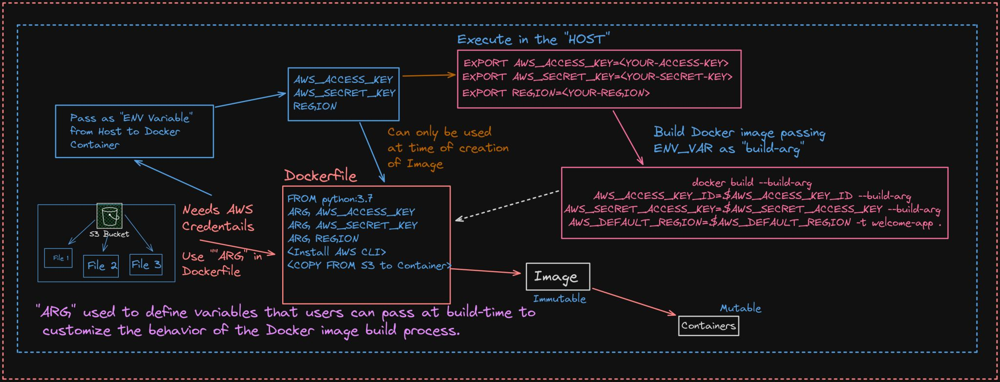

# Copy S3 Files to Docker Image

In a typical workflow, where essential files reside within an S3 Bucket but are imperative for the creation of Docker Containers, leveraging Dockerfile instructions becomes pivotal.

- Indeed, we can harness the power of "`ARG`" within the Dockerfile. This nifty feature enables the passage of variables during build time, thereby offering flexibility to tailor the behavior of the Docker Image Build Process according to user requirements.

- To facilitate the seamless import of files from S3, certain prerequisites must be fulfilled. Primarily, the AWS CLI needs to be installed within the Docker image. Additionally, users are prompted to provide their `AWS_ACCESS_KEY`, `AWS_SECRET_KEY`, and `REGION` within the Dockerfile, ensuring secure and authorized access to the S3 resources.

- The process unfolds as we initiate the Docker image building using the docker build command, accompanied by the `--build-arg` flag to inject the necessary variables seamlessly.

It's essential to note that while environment variables (ENV_VAR) containing credentials are employed during the Docker Image creation, they remain encapsulated within the container. However, they can be inspected further by echoing `ENV_VAR` within the Docker Container, ensuring transparency and security.

For a more comprehensive understanding of the workflow and the Dockerfile implementation, refer to the example below:

## Authors

- [PavanGandham](https://linktr.ee/venkatasaipavanGandham)

## Documentation

[Dockerfile Commands](https://docs.docker.com/reference/dockerfile/)

